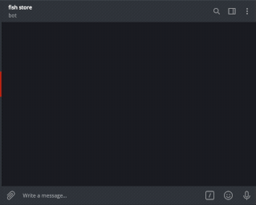

# Магазин в Телеграмме

Этот бот умеет продавать товары в telegram. Для примера, на скриншоте он продаёт рыбу. Бот интегрирован с CMS [Moltin](https://www.moltin.com/). Так же бот использует базу данных на [Redislabs](https://redislabs.com). В боте можно выбрать несколько товаров, они сложатся в корзину покупок. Когда клиент решит, что готов к оплате, его попросят дать контактный адрес электронной посты для обратной связи.

 
------------------------------- 

## Установка и запуск

Python3 должен быть уже установлен. Затем используйте pip (или pip3, если есть конфликт с Python2) для установки зависимостей:

```
pip install -r requirements.txt
```

Создайте базу данных на [Redislabs](https://redislabs.com)

Для установки создайте файл .env, в котором заполните следующие переменные окружения:
- `TG_ACCESS_TOKEN` - Секретный ключ бота telegram для магазина.
- `TG_LOG_TOKEN` - Секретный ключ бота для информации об ошибках.
- `TG_CHAT_ID` - ID чата текущего пользователя telegram.
- `MOLTIN_CLIENT_SECRET` - Секретный токен магазина в CMS [Moltin](https://www.moltin.com/).
- `MOLTIN_CLIENT_ID` - Client ID магазина в CMS [Moltin](https://www.moltin.com/).
- `REDIS_HOST` - Адрес базы данных redis.
- `REDIS_PORT` - Порт для подключения к базе данных redis.
- `REDIS_PASSWORD` - Пароль для подключения к базе данных redis.


Запускают скрипт без параметров:

```
python.exe tg_bot.py
```	

Информацию о ходе выполнения скрипт отправляют отдельному боту telegram. Токен его должен быть указан в соответствующей переменной окружения.
В составе скрипта присутствует файл `Procfile`, необходимый для деплоя на сервер [HEROKU](https://heroku.com). Файл уже настроен должным образом, поэтому перенос скрипта на сервер выполняется в соответствии с документацией сервера [HEROKU](https://devcenter.heroku.com/articles/git).


## Цель проекта

Код написан в образовательных целях, для изучения возможностей чат-ботов, на онлайн-курсе для веб-разработчиков [dvmn.org](https://dvmn.org).
